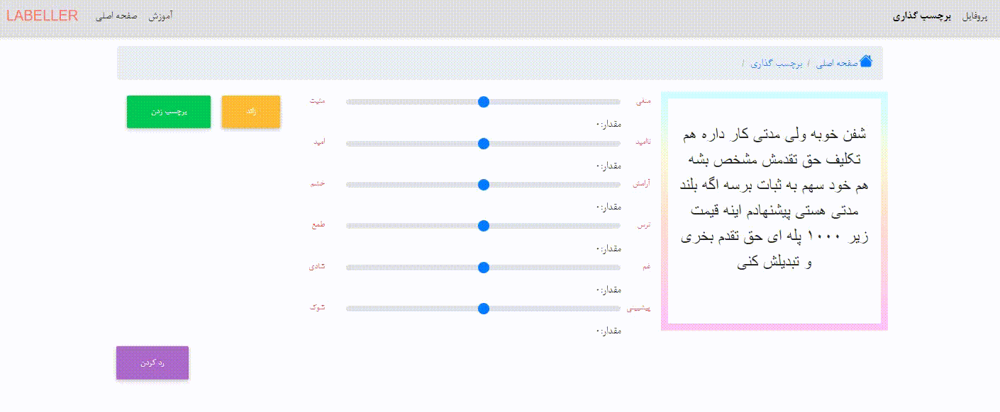

# www.labeller.ir
    Persian Crowdsourcing Platform - پلتفرم برچسب گذاری تعاملی فارسی
## لِیبلِر اولین سرویس برچسب گذاری تعاملی فارسی
لیبلر اولین سرویس برچسب گذاری تعاملی فارسی به‌منظور فراهم آوردن یک دیتاست با داده‌های فراوان جهت کار با الگوریتم‌های عمیق و سایر روش‌های مرسوم تحلیل احساسات است.
 
در این سیستم که برچسب‌ها به روش جمع‌سپاری(Crowdsourcing) اطمینان سنجی می‌شوند،اصل بر همکاری،تعامل و سود جمعی میباشد.بدین طریق که هرچه فعالیت شما در سیستم بیشتر
باشد به همان نسبت به شما اجازه دسترسی به دیتاست برچسب گذاری شده بزرگ‌‌تری داده خواهد شد. 
## قوانین
قوانین زیر به‌منظور عدالت هرچه بیشتر در سیستم پیاده سازی شده است:
- **در هر بار برچسب گذاری تعداد 10 داده متنی به شما نمایش داده میشود. با برچسب زدن هر یک به تعداد اعتبارهای شما اضافه میشود.**
- **برای دانلود دیتاست باید حداقل 100 اعتبار بدست آورید.**

نمونه کوچکی از دیتاست که بر روی آن کار می‌کنیم بارگذاری شده است که قابل دسترسی میباشد. 
**این سیستم عام المنفعه میباشد و جهت ارتقا هرچه بیشتر جامعه علمی بنا نهاده شده است.امیدواریم در این مسیر در کنار یکدیگر دستاوردهای ارزشمندی را رقم بزنیم.** 

هرگونه استفاده تجاری از دیتاست تکمیل شده **مطلقا ممنوع** میباشد.

## ویژگی ها
- **رایگان**
- **فارسی**
- **کاملا تعاملی و اشتراکی**
- **ساده و آسانی استفاده**

